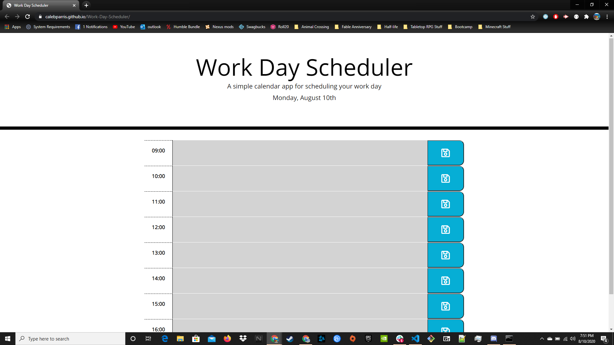

# Work-Day-Scheduler

## Objective
The objective of this homework was to create a workday scheduler that would display the current day at the top of the page. It also needed to have the type-field change to match the time of day and indicate whether or not the time is in the future or the past. The last thing it needed was to be able to save the typed information on a button click and it stay on the page even when refreshed.

## Challengs & Solutions
The first challenge I had with this was getting the current time to match the time slots on the scheduler. I solved this but changing the current time into military time and making an array of all the time slots. Then I had to make an if-else statment to compare them together and see if they were the same or if the time slot was before/after the current time. The next challenge I faced was getting the scheduler to render on the page. I accomplished this by using a for loop to create a form for each of the time slots. The biggest challenge was getting the saved text information to stay on the page after a refresh. To finish this I had to store the typed information into the local storage when the save button was clicked. After that, I had to create a function that would get the value from the local storage and add it to the text field when the page loads to insure the saved information did not disappear when the pagewas refreshed.

## Links and Pictures
Here is a link to the finished scheduler: https://calebparris.github.io/Work-Day-Scheduler/

Here is a screenshot of the page after 5pm:

